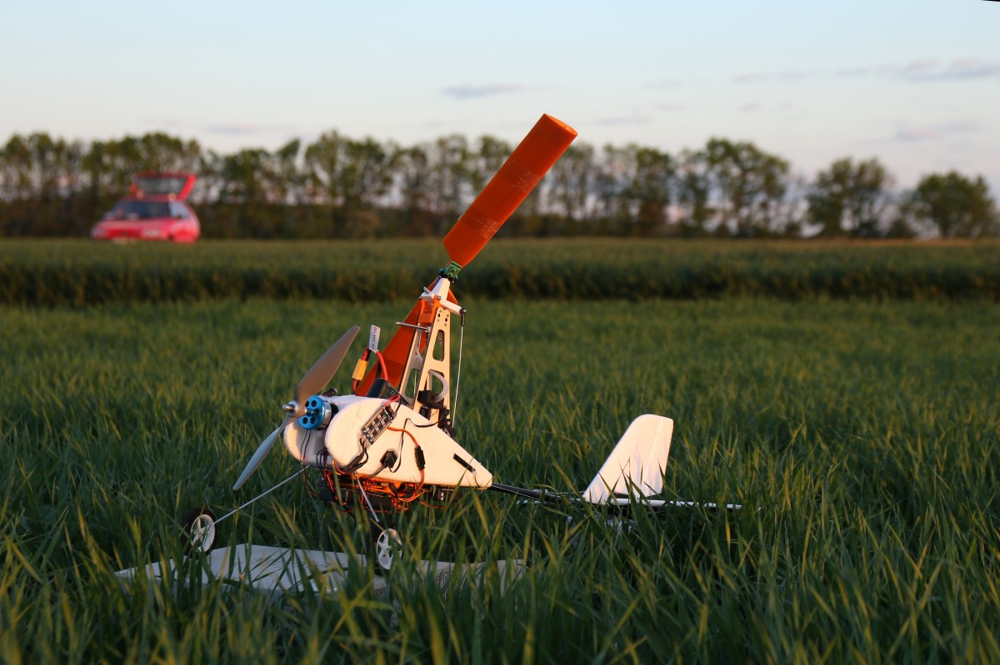

# Auto-G2 - Small gyroplane model
The design is based on [Auto-G2 by Durafly](https://hobbyking.com/en_us/duraflytm-auto-g2-gyrocopter-w-auto-start-system-821mm-pnf.html) which is extended by [PX4 autopilot](https://en.wikipedia.org/wiki/PX4_autopilot). The Auto-G2 model is discontinued and is not longer available. 
Adequate substitute is the [3D printed TF-G2 autogyro kit](https://github.com/ThunderFly-aerospace/TF-G2). 

The original purpose of this model is the training and testing of PX4 software improvements, prior the autogyro airframe has been sucessfully merged to [PX4 airframes](https://docs.px4.io/main/en/airframes/airframe_reference.html#autogyro). 

